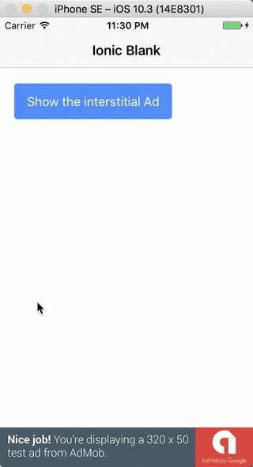

## Ionic3AdMobTest

How to make money with Google AdMob ads in Ionic framework 3

The step by step tutorial is published and you can, of course, check it out for free: [How to make money with Google AdMob ads in Ionic framework 3](http://www.nikola-breznjak.com/blog/javascript/ionic3/make-money-google-admob-ads-ionic-framework-3/).

### How to use this code
+ make sure you have Ionic installed. For instructions on how to, please check out the first tutorial in this series: [How to get started with Ionic framework 3 on Mac and Windows](http://www.nikola-breznjak.com/blog/javascript/ionic3/get-started-ionic-framework-3-mac-windows/)
+ clone the code from this repo
+ in the project directory execute `npm install` and then `ionic emulate ios` or `ionic emulate android`
+ if you hit any roadblocks, you can ping me in the blog post comments

Here's a gif of how it looks/works:

